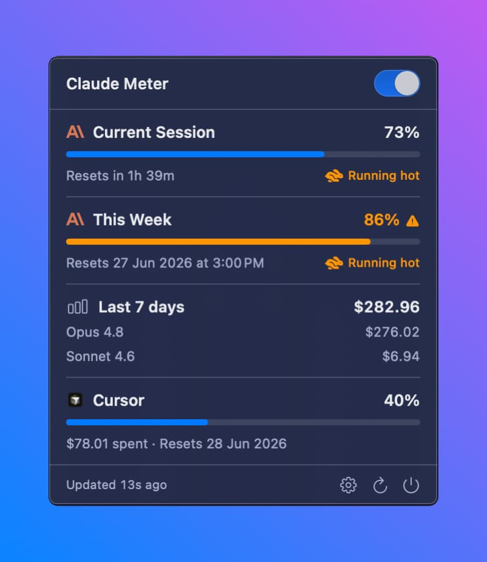

# Claude Meter

A macOS menu bar app that shows your Claude usage at a glance — current 5-hour
session and weekly limits, with color-coded progress and optional notifications.

<p align="center">
  
</p>

## Features

- **Menu bar meter** — current-session and weekly usage percentages, always visible.
- **Zero-config with Claude Code** — installs a transparent statusline bridge; no API keys needed.
- **Optional sources** — Claude Code OAuth usage API, the claude.ai usage API, and (opt-in) Cursor billing-period usage.
- **Desktop widget**, threshold-based notifications, launch at login, and auto-updates.
- **Private** — local-first; Claude credentials live in the macOS Keychain. Cursor reads the locally signed-in Cursor app's token store (read-only); nothing is logged.

## Requirements

- macOS 14+
- [Claude Code](https://docs.anthropic.com/en/docs/claude-code) (for the zero-config statusline source)

## Build

```bash
xcodebuild -scheme ClaudeMeter -configuration Debug CODE_SIGNING_ALLOWED=NO  # compile
swift test --package-path ClaudeMeterCore                                    # core tests
```

Running the app requires a provisioning profile (App Group entitlement).

## Docs

- `SPECS.md` — full specification
- `AGENTS.md` — development notes
- `DESIGN.md` — UI design system and tokens

## License

[MIT](LICENSE) © Jewei Mak

## Disclaimer

Claude Meter is an independent, community project. It is not affiliated with,
endorsed by, or sponsored by Anthropic. "Claude" is a trademark of Anthropic.
