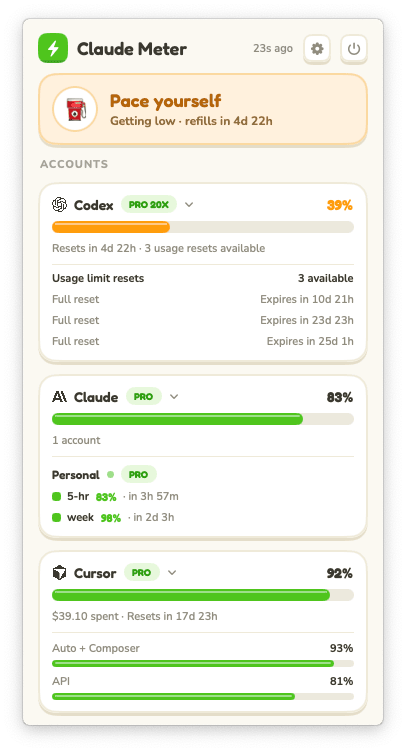

# Claude Meter

A macOS menu bar app that shows your coding quota at a glance. Claude, Codex, Cursor, and
Grok usage appear as playful, color-coded **energy rings**, across every account.

<table>
  <tr>
    <th align="center">Light mode</th>
    <th align="center">Dark mode</th>
  </tr>
  <tr>
    <td></td>
    <td></td>
  </tr>
</table>

## Features

- **Menu bar meter**: a bolt, a nearest-limit status dot, and your energy-left percentage.
- **Playful popover**: a health hero and per-account **activity rings** (weekly and
  5-hour), with countdowns from provider-reported reset times.
- **Multiple accounts**: run several `CLAUDE_CONFIG_DIR` accounts or Codex homes side by
  side. Give each a display name and plan badge.
- **Four providers**: Claude or Codex owns the main meter. Cursor billing-period usage and
  Grok CLI credits have their own cards.
- **Private**: no transcript scanning or cost estimation. Provider credentials stay in
  their own apps and are read-only; only manually entered Claude OAuth tokens are stored,
  in macOS Keychain. Diagnostics are sanitized before display or persistence.
- Launch at login and automatic updates.

Usage refreshes every five minutes while the display is awake. Opening the popover
refreshes missing, failed, stale, or at least one-minute-old readings. Display sleep
stops refresh work.

Codex usage comes directly from its OAuth sign-in. Codex keeps ownership of its
credentials, and API-key sign-ins supply no ChatGPT subscription quota.

## Requirements

- macOS 14+
- For Claude: a [Claude Code](https://docs.anthropic.com/en/docs/claude-code) sign-in, or
  manually supplied OAuth credentials

## Install

1. Download the latest **`ClaudeMeter-<version>.dmg`** from the
   [releases page](https://github.com/jewei/claude-meter/releases/latest).
2. Open the DMG and drag **Claude Meter** into your **Applications** folder.
3. Launch it — the meter appears in your menu bar (there's no Dock icon).

The app is Developer ID signed and notarized by Apple, so it opens without Gatekeeper
warnings. Sparkle delivers updates automatically.

## Build

```bash
./scripts/verify-local.sh  # formatting, all package tests, Debug + Release unsigned builds
```

For a faster focused check, run `swift test --package-path ClaudeMeterCore`.

## Docs

- [SPECS.md](SPECS.md): behavior specification
- [DESIGN.md](DESIGN.md): UI design system and tokens
- [AGENTS.md](AGENTS.md): development rules
- [Release verification](docs/releases.md): signing, notarization, and release checks
- [Issue workflow](docs/agents/issue-tracker.md): GitHub issue and triage conventions

## License

[MIT](LICENSE) © Jewei Mak

## Disclaimer

Claude Meter is an independent, community project. It is not affiliated with,
endorsed by, or sponsored by Anthropic. "Claude" is a trademark of Anthropic.
