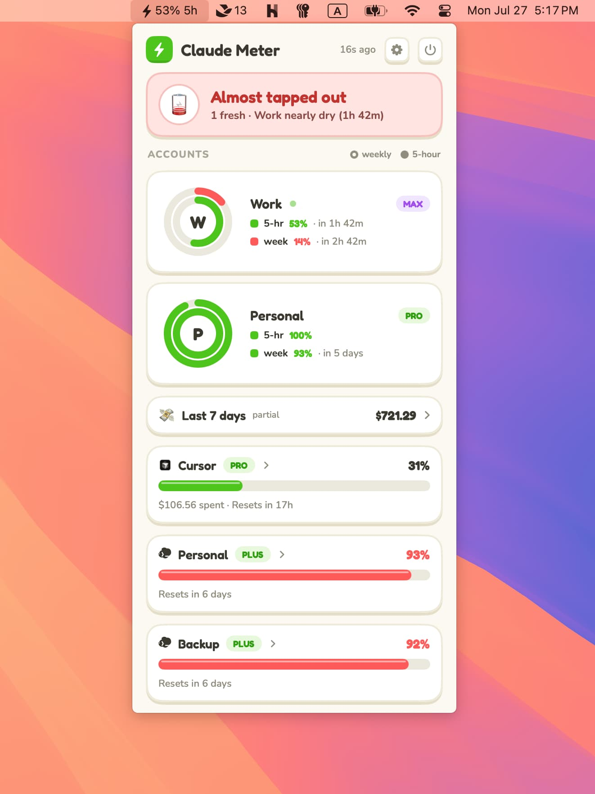
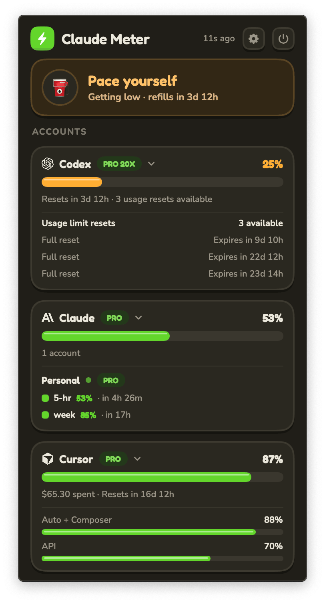

# Claude Meter

A macOS menu bar app that shows your Claude usage at a glance — your 5-hour
session and weekly limits as playful, color-coded **energy rings**, across every
account, with optional notifications.

<table>
  <tr>
    <th align="center">Light mode</th>
    <th align="center">Dark mode</th>
  </tr>
  <tr>
    <td></td>
    <td></td>
  </tr>
</table>

## Features

- **Menu bar meter** — an energy bolt + a nearest-limit status dot and your energy-left %, always visible.
- **Playful popover** — a combined-health hero and per-account **activity rings** (weekly + 5-hour), framed as energy remaining — plus a desktop widget, threshold notifications, launch at login, and auto-updates.
- **Multi-account aware** — run several `CLAUDE_CONFIG_DIR` accounts side by side (rate limits are per-account); give each a display name and plan badge.
- **Zero-config with Claude Code** — installs a transparent statusline bridge; no API keys needed.
- **Optional sources** — Claude Code OAuth, Cursor billing-period usage, multiple Codex homes, and Grok CLI credits. Non-Claude providers stay separate from Claude's menu-bar meter and notifications.
- **Private** — local-first and read-only toward provider credentials. Claude credentials remain in macOS Keychain; Cursor, Codex, and Grok read their own local sign-in state. Diagnostics are sanitized before display or persistence.

## Requirements

- macOS 14+
- [Claude Code](https://docs.anthropic.com/en/docs/claude-code) (for the zero-config statusline source)

## Install

1. Download the latest **`ClaudeMeter-<version>.dmg`** from the
   [releases page](https://github.com/jewei/claude-meter/releases/latest).
2. Open the DMG and drag **Claude Meter** into your **Applications** folder.
3. Launch it — the meter appears in your menu bar (there's no Dock icon).

The build is Developer-ID signed and notarized by Apple, so it opens without
Gatekeeper warnings. Updates are delivered automatically via Sparkle.

## Build

```bash
./scripts/verify-local.sh  # formatting, all package tests, Debug + Release unsigned builds
```

Running the app requires a provisioning profile (App Group entitlement).
For a faster focused check, run `swift test --package-path ClaudeMeterCore`.

Release builds attach a versioned `.dSYMs.zip` to the GitHub release. The release
script verifies app and widget symbol UUIDs against the shipped binaries before
publication. Keep that archive for crash analysis; the local `build/` directory
is replaced by the next release build.

## Docs

- `SPECS.md` — full specification
- `AGENTS.md` — development notes
- `DESIGN.md` — UI design system and tokens
- `docs/agents/` — conventions for coding agents (issue tracker, triage labels, domain docs)

## License

[MIT](LICENSE) © Jewei Mak

## Disclaimer

Claude Meter is an independent, community project. It is not affiliated with,
endorsed by, or sponsored by Anthropic. "Claude" is a trademark of Anthropic.
