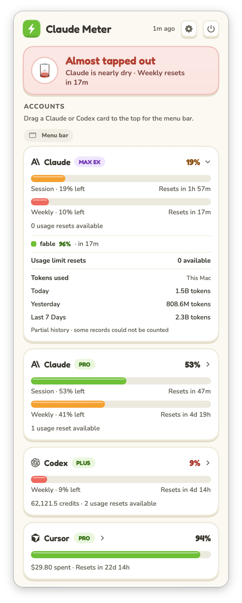
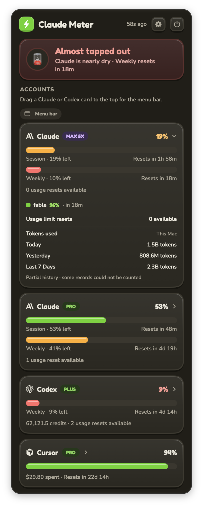

# Claude Meter

Claude Meter shows coding quota for Claude, Codex, Cursor, and Grok in the macOS menu
bar. Account cards show energy left with colored rings or bars.

<table>
  <tr>
    <th align="center">Light mode</th>
    <th align="center">Dark mode</th>
  </tr>
  <tr>
    <td></td>
    <td></td>
  </tr>
</table>

## Quota display

The app includes these display and account options:

- A menu-bar bolt, a status dot for the nearest limit, and an energy-left percentage.
- A hero that summarizes quota and account cards with weekly and 5-hour limit windows.
  Reset countdowns use provider-reported times.
- Multiple `CLAUDE_CONFIG_DIR` accounts and Codex homes, with custom names and plan
  badges.
- A main meter for Claude or Codex, plus separate cards for Cursor usage and Grok CLI
  credits.
- Launch at login and automatic updates.

Usage refreshes every five minutes while the display is awake. Opening the popover
refreshes missing, failed, stale, or at least one-minute-old readings. Display sleep
stops refresh work.

## Credentials and privacy

Claude Meter reads provider quota without scanning transcripts or estimating costs.
Provider apps own their credentials. Claude Meter writes only manually entered Claude
OAuth credentials to its own macOS Keychain entry. Diagnostics remove sensitive data
before display or storage.

Codex usage comes from its OAuth sign-in. API-key sign-ins supply no ChatGPT
subscription quota. If sign-in recovery is necessary, Claude Meter can start a temporary
Codex process. Codex can then refresh and save its own credentials. Upgrades can remove
obsolete Claude Meter integration entries. [Provider credentials and
recovery](docs/providers.md) describes credential sources, recovery, and cleanup.

## System requirements

The app requires the following:

- macOS 14+
- For Claude: a [Claude Code](https://docs.anthropic.com/en/docs/claude-code) sign-in,
  or manually supplied OAuth credentials

## Installation and development guides

These guides cover installation, builds, and measurements:

- [Install Claude Meter](docs/install.md).
- [Build and test Claude Meter](docs/development.md).
- [Measure performance](docs/performance.md).

The release app has a Developer ID signature and Apple notarization. Sparkle provides
automatic updates.

## Project documents

These documents define the product and development process:

- [SPECS.md](SPECS.md): behavior specification
- [DESIGN.md](DESIGN.md): UI design system and tokens
- [AGENTS.md](AGENTS.md): development rules
- [Release verification](docs/releases.md): signing, notarization, and release checks
- [Issue workflow](docs/agents/issue-tracker.md): GitHub issue and triage conventions

## License

[MIT](LICENSE) © Jewei Mak

## Disclaimer

Claude Meter is an independent, community project. It is not affiliated with, endorsed
by, or sponsored by Anthropic. "Claude" is a trademark of Anthropic.
